# ACP Merchant Demo

Reference implementation of the [Agentic Commerce Protocol](https://agenticcommerce.dev) (ACP) — the open standard co-developed by Stripe and OpenAI enabling AI agents to complete purchases on behalf of users.

**Live demo:** [acp-merchant-demo.vercel.app/demo](https://acp-merchant-demo.vercel.app/demo)

## Highlights

- **Full ACP Protocol** — CreateCheckout, UpdateCheckout, CompleteCheckout endpoints per spec
- **Real Stripe Integration** — PaymentIntents created on every completed checkout
- **Interactive Demo** — Visual representation of Agent ↔ Merchant protocol flow
- **Webhook Support** — Handles `payment_intent.succeeded`, `payment_intent.payment_failed`
- **Production Ready** — Zod validation, error handling, structured logging

<p align="center">
  
  <br/>
  <sub><b>Checkout Flow</b> — Real-time ACP protocol visualization with live API responses.</sub>
</p>

<table>
  <tr>
    <td align="center" width="50%">
      
      <br/>
      <sub><b>Product Selection</b> — Click to initiate ACP checkout.</sub>
    </td>
    <td align="center" width="50%">
      
      <br/>
      <sub><b>Order Complete</b> — Real PaymentIntent in Stripe.</sub>
    </td>
  </tr>
  <tr>
    <td align="center" width="50%">
      
      <br/>
      <sub><b>Request Log</b> — Full protocol request/response history.</sub>
    </td>
    <td align="center" width="50%">
      
      <br/>
      <sub><b>Stripe Transaction</b> — Real payment with <code>acp_checkout_id</code> metadata linking systems.</sub>
    </td>
  </tr>
</table>

## Why This Matters

ACP represents a fundamental shift in e-commerce: instead of users navigating checkout pages, AI agents handle the entire purchase flow programmatically. This demo implements the **merchant side** of that protocol.

| What ACP Solves | How |
|-----------------|-----|
| N×M integration problem | Universal protocol — each agent/merchant implements once |
| Trust & payment security | SharedPaymentToken with scoped permissions |
| UI control | Agent renders UI, merchant controls pricing/fulfillment |

## Demo (60 seconds)

1. Visit [acp-merchant-demo.vercel.app/demo](https://acp-merchant-demo.vercel.app/demo)
2. Click any product → Checkout card appears, JSON updates (real `POST /api/acp/checkout`)
3. Change shipping → Totals recalculate (real `POST /api/acp/checkout/update`)
4. Click "Pay" → Purchase completes (real `POST /api/acp/checkout/complete`)
5. Expand "ACP REQUESTS" → View full request/response history
6. Check [Stripe Dashboard](https://dashboard.stripe.com/test/payments) → PaymentIntent created

## Architecture


**Tech Stack:**
- Next.js 14 (App Router, TypeScript)
- Stripe SDK
- Zod validation
- Tailwind CSS
- Vercel (deployment)

## API Endpoints

| Endpoint | Method | Description |
|----------|--------|-------------|
| `/api/acp/checkout` | POST | Create checkout session |
| `/api/acp/checkout/update` | POST | Update shipping, address, email |
| `/api/acp/checkout/complete` | POST | Complete with payment token |
| `/api/acp/webhooks` | POST | Handle Stripe webhook events |
| `/api/health` | GET | Health check with store stats |
| `/.well-known/acp.json` | GET | ACP discovery endpoint |

## ACP Protocol Flow

```mermaid
sequenceDiagram
    participant User
    participant Agent as AI Agent
    participant Merchant as ACP Merchant
    participant Stripe

    User->>Agent: "Buy running shoes"
    Agent->>Merchant: POST /checkout {items}
    Merchant-->>Agent: {checkout_id, shipping_options, total}
    
    Agent->>User: "Shipping: Standard or Express?"
    User->>Agent: "Standard"
    
    Agent->>Merchant: POST /checkout/update {shipping_option}
    Merchant-->>Agent: {updated_total, ready_for_payment}
    
    Agent->>User: "Total: $135.98. Confirm?"
    User->>Agent: "Yes"
    
    Agent->>Stripe: Request SharedPaymentToken
    Stripe-->>Agent: {payment_token}
    
    Agent->>Merchant: POST /checkout/complete {payment_token}
    Merchant->>Stripe: Create PaymentIntent
    Stripe-->>Merchant: {payment_intent_id}
    Merchant-->>Agent: {order_id, status: completed}
    
    Agent->>User: "Order confirmed! 🎉"
```



## Quickstart

```bash
# Clone
git clone https://github.com/nickcarndt/acp-merchant-demo.git
cd acp-merchant-demo

# Install
npm install

# Configure
cp .env.example .env.local
# Edit .env.local with your Stripe keys

# Run
npm run dev
```

Open [http://localhost:3000/demo](http://localhost:3000/demo)

## Environment Variables

| Variable | Description | Required |
|----------|-------------|----------|
| `STRIPE_SECRET_KEY` | Stripe API secret key (test mode) | Yes |
| `STRIPE_WEBHOOK_SECRET` | Webhook signing secret | For webhooks |
| `ACP_AUTH_TOKEN` | Bearer token for ACP endpoints | Yes |
| `NEXT_PUBLIC_ACP_AUTH_TOKEN` | Client-side auth token | For demo UI |

## Deploy (Vercel)

```bash
# Deploy
vercel

# Set environment variables in Vercel dashboard
# Redeploy
vercel --prod
```

**Webhook Setup:**
1. Stripe Dashboard → Developers → Webhooks
2. Add endpoint: `https://your-app.vercel.app/api/acp/webhooks`
3. Select events: `payment_intent.succeeded`, `payment_intent.payment_failed`
4. Copy signing secret to Vercel env vars

## Testing

```bash
# Smoke test (local)
./test-acp.sh

# Smoke test (production)
./test-acp-prod.sh
```

## Related Projects

| Project | Description |
|---------|-------------|
| [MCP Server](https://github.com/nickcarndt/mcp-partner-integration-demo) | AI agent tools for Stripe/Shopify (agent side) |
| [Chatbot with Memory](https://github.com/nickcarndt/chatbot-with-memory) | Full-stack AI chatbot with MCP integration |

## Resources

- [ACP Specification](https://agenticcommerce.dev)
- [Stripe ACP Docs](https://docs.stripe.com/agentic-commerce/protocol)
- [OpenAI Commerce Docs](https://developers.openai.com/commerce)
- [SharedPaymentToken](https://docs.stripe.com/agentic-commerce/concepts/shared-payment-tokens)

## Author

**Nicholas Arndt** — [GitHub](https://github.com/nickcarndt) · [LinkedIn](https://linkedin.com/in/nicholasarndt)

## License

[MIT](LICENSE) © 2025 Nicholas Arndt
